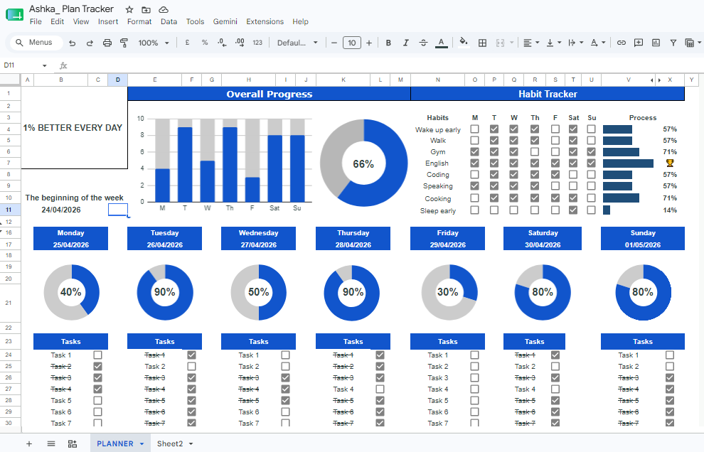

# Habit Tracker Dashboard

A clean and practical habit-tracking dashboard built in Google Sheets to help users plan, monitor, and review daily routines with clarity and consistency.

  

## Overview

This project is designed for users who want a simple yet structured way to track habits, maintain daily discipline, and measure progress over time. Built with a professional layout, it focuses on usability, scalability, and easy maintenance.

The dashboard allows users to:
- Track daily habit completion
- Monitor weekly progress visually
- Review consistency over time
- Customize habits and categories easily
- Maintain a neat and focused productivity workflow

## Live Dashboard

View the live Google Sheets tracker here:

https://docs.google.com/spreadsheets/d/1JrSYsC-FdZR2N8Sf2B9goOef-FE13b3ndX7-jCQnVb0/edit?usp=sharing

## Key Features

- Daily habit tracking using checkboxes
- Automatic progress calculation and summaries
- Weekly trend visualization with SPARKLINE charts
- Simple, organized layout for easy use
- Flexible structure to support additional habits and categories
- Clean, professional visual design for productivity-focused tracking

## Tools & Technologies

- Google Sheets
- Formulas such as COUNTIF and SPARKLINE
- Checkbox automation
- Progress visualization
- Spreadsheet-based dashboard design

## Why This Project

The goal of this project is to demonstrate practical spreadsheet thinking, good information organization, and user-friendly dashboard design. It showcases how a regular spreadsheet can become a powerful personal productivity tool without requiring complex software.

## File Information

- Format: Google Sheets / Excel-based dashboard
- Use case: Habit tracking and weekly productivity monitoring
- Scope: Scalable for multiple habits and time periods

## Notes

- Designed with a clean neutral color palette
- Built for simplicity, usability, and consistency
- Suitable for personal productivity, routines, and self-improvement tracking

---

If you want, I can also help convert this project into a more advanced version with:
- a mobile-friendly dashboard,
- a custom color theme,
- automated charts and KPI cards,
- or a web-based version using HTML/CSS/JavaScript.
